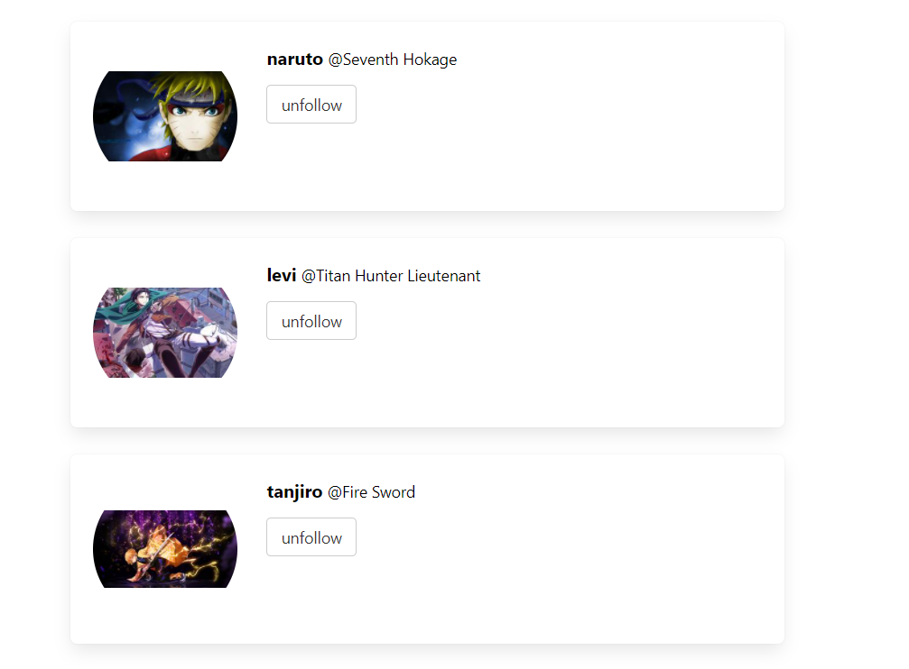
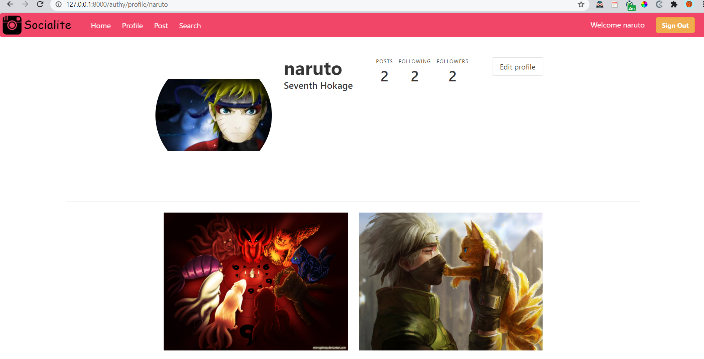
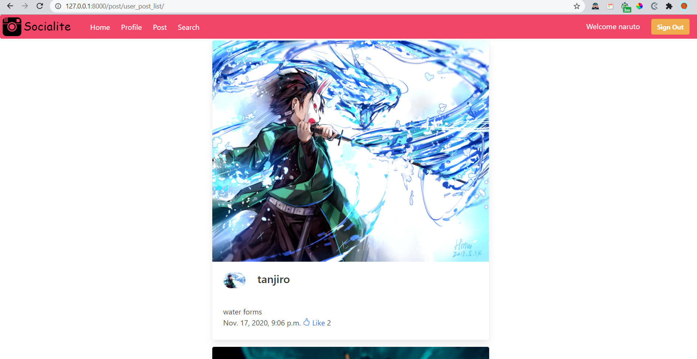
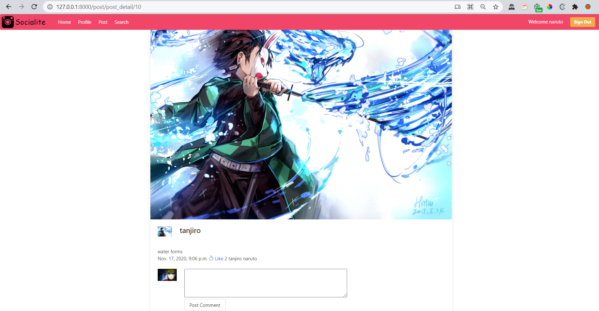

[comment]: <> (# Hosted URL)

[comment]: <> (https://socialite-blog.azurewebsites.net/)

# Socialite <br>

Social website with multi-user feature , comments , Like , follow system and unique style.

Made with Django, Python3, Html, Bootstrap ,CSS, js, jquery.
<br>

# features

- Each Post has a user, posted date, Likes and comment section
- Login / Signup :heavy_check_mark:
- Comments and Like for every post :thumbsup:
- Search Users by name and follow them to see what they post.
- Authenticated user can comment and like else they will prompted to login

# ScreenShots









# Project Setup

- git clone the project
- cd into the project directory
- Create python environment or use existing
- ```pip install -r requirements.txt```
- Run the following commands
- ```python manage.py makemigrations```
- ```python manage.py migrate```
- ```python manage.py runserver```

This will start a server on localhost:8000

# Thank You !!


